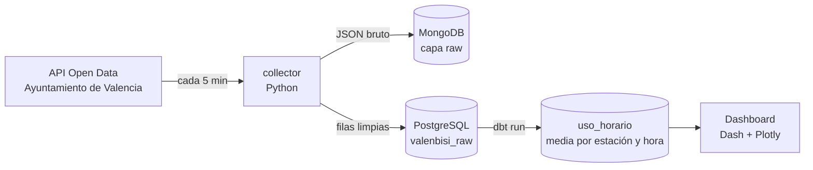

# 🚲 Valenbisi Data Pipeline


Pipeline de datos en tiempo real sobre **Valenbisi**, el servicio de bicicleta compartida de Valencia. Cada 5 minutos descarga el estado de todas las estaciones desde la API de datos abiertos del Ayuntamiento, guarda el dato bruto en **MongoDB** y el dato estructurado en **PostgreSQL**, lo transforma con **dbt** y lo muestra en un **mapa interactivo** que se actualiza solo.

Todo arranca con un único `docker compose up`.

---

## Arquitectura



| Servicio | Tecnología | Qué hace |
| --- | --- | --- |
| `collector` | Python, requests | Descarga las estaciones cada 5 minutos y escribe en las dos bases de datos |
| `mongodb` | MongoDB | Conserva la respuesta original de la API, por si hay que reprocesar |
| `db` | PostgreSQL 15 | Guarda una fila por estación y lectura, con coordenadas, bicis y anclajes libres |
| `transform` | dbt-postgres | Agrega la ocupación media por estación y hora (`uso_horario`) y la valida con tests |
| `dashboard` | Dash, Plotly | Mapa de Valencia con el estado de cada estación; se refresca cada 30 s |

### Por qué dos bases de datos

MongoDB guarda el JSON tal y como llega: si la API cambia de formato (ya ha pasado, por ejemplo con las coordenadas), el histórico se puede reprocesar sin perder nada. PostgreSQL guarda solo lo necesario en un esquema fijo, que es lo que necesita dbt para modelar y el dashboard para consultar rápido.

---

## Cómo ejecutarlo

Requisito: Docker Desktop.

```bash
git clone https://github.com/RicardoEdreiraPenas/valenbisi-data-pipeline.git
cd valenbisi-data-pipeline
cp .env.example .env          # opcional: cambia la contraseña local
docker compose up --build
```

| Servicio | Dirección |
| --- | --- |
| Dashboard | http://localhost:8050 |
| PostgreSQL | localhost:5432 |
| MongoDB | localhost:27017 |

El collector espera unos segundos a que las bases de datos estén listas y empieza a descargar. Para actualizar la capa transformada con los datos nuevos:

```bash
docker compose run --rm transform          # dbt run
docker compose run --rm --entrypoint dbt transform test
```

## Modelo dbt

`uso_horario` agrupa las lecturas por estación y hora y calcula la media de bicicletas disponibles y de anclajes libres. Incluye tests de `not_null` sobre la estación y la hora.

## Estructura

```
├── collector/        Descarga desde la API y escritura en MongoDB y PostgreSQL
├── db/init.sql       Tabla de lecturas en PostgreSQL
├── transform/        Proyecto dbt (modelo uso_horario y sus tests)
├── dashboard/        Mapa interactivo con Dash y Plotly
└── docker-compose.yml
```

## Datos

Fuente: [Valenbisi: disponibilidad](https://valencia.opendatasoft.com/explore/dataset/valenbisi-disponibilitat-valenbisi-dsiponibilidad/), portal de datos abiertos del Ayuntamiento de Valencia.

## Autor

**Ricardo Edreira Penas** · Data Analyst · Data Engineer Junior
[LinkedIn](https://www.linkedin.com/in/ricardoedreira) · [GitHub](https://github.com/RicardoEdreiraPenas)
